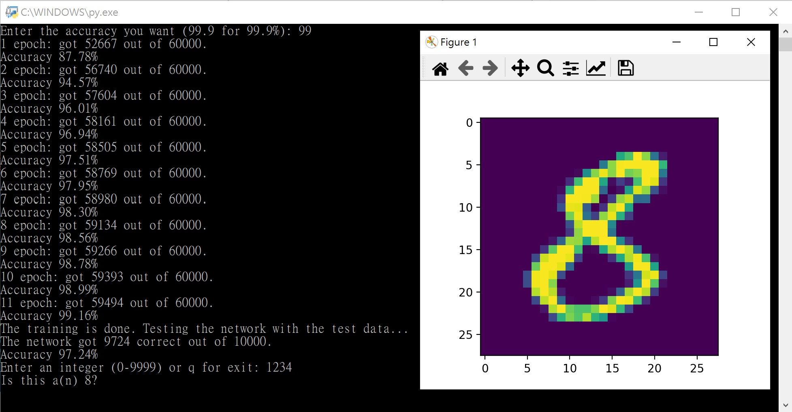

# NeuralNetwork
A simple neural network which is able to recognize 28*28 pixel images from the MNIST.

## Demonstration

The program runs as follows.
1. The network will be trained with 60000 images for several epochs until the demanded accuracy is achieved.
2. Test the trained network with 10000 test images and show the resulting accuracy.
3. User can choose an image in the test data. It will show the image and output the number it recognizes.

## Setup
1. Clone/Download the repositary.
2. Run main.py with Python.

## Credits
The essence of code comes from the youtube channel [Bot Academy](https://www.youtube.com/c/BotAcademyYT) ([Github](https://github.com/Bot-Academy)).
The amazing works in the channel taught me how to implement the simplest neural network from scratch.
